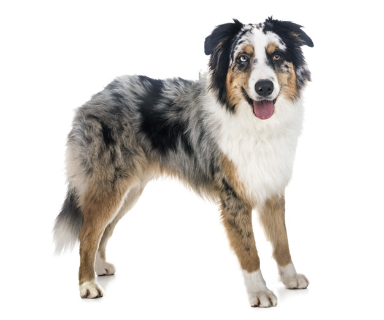
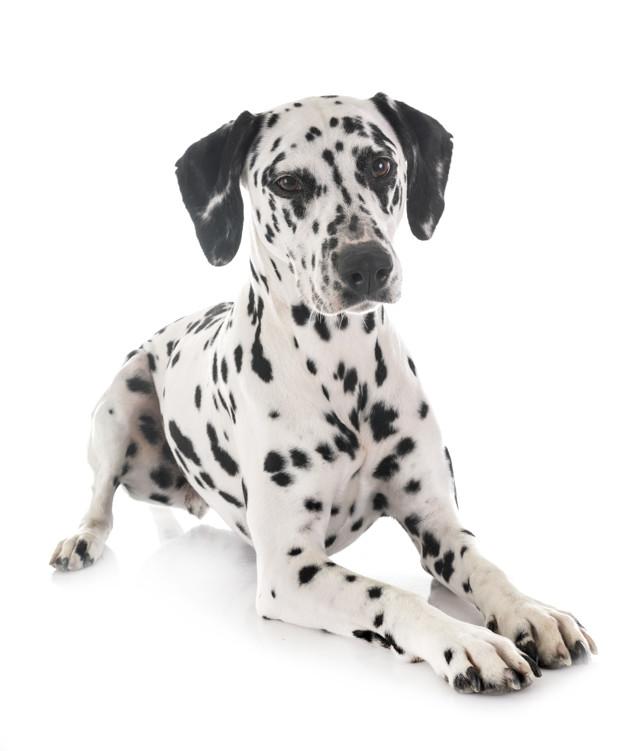
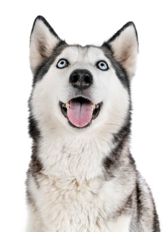

# StrandsDogs by Eileen Juergens 🐕‍🦺

- [1. Getting started](#1-getting-started)
- [2. Challenge](#2-challenge)
- [3. Testing](#3-testing)
- [4. Comments](#4-comments)
  - [4.1. Decisions](#41-decisions)
  - [4.2. Prospects](#42-prospects)
- [5. Developer](#5-Developer)
  - [5.1. Contact](#51-Contact)
  - [5.2. Favorite Dogs](#52-favorite-dogs)

## 1. Getting started
Fork this repo and then `git clone` your forked repo to your computer. Run `npm install` in the root directory. Run the app in the development mode with `npm start` in the root directory, this will open [http://localhost:3000](http://localhost:3000) to view the app in the browser.

## 2. Challenge
This challenge should be build with React and Redux under the use of best practices, architecture and smart use of ES6 features. The [dogs API] ([https://dog.ceo/dog-api/documentation/​] should be used to retrieve the data.

In the first task the API should be called to retrieve the list of all dog breeds. With the use of this API all breeds of dogs should be retrieved and saved to the Redux store. There was no need to retrieve as well the sub-breeds lists. 

In the second step the dogs should be counted. Everybody can submit one or multiple images of his dog while mention the breed name to the API, that is an open-source. In the calculation should be counted and saved the amount of images that were uploaded for each breed. 

In the third and last step the results should be displayed in a pie chart. Due to the fact that actual 90 different breeds exist, the display of the results should be limited to ten. Therefore the ten breeds with the most uploaded images should be shown in the chart. In each peace of the pie chart should be seen as well the percentage of images that were uploaded for this breed measured on the total amount of images from all 90 breeds.

## 3. Testing solution
To test the functionality of Redux, run `npm test test/actions.test.js` and afterwards `npm test test/reducers.test.js` in the root directory of this repo.

## 4. Comments

### 4.1. Decisions

### 4.2. Prospects

## 5. Developer

### 5.1. Contact
Eileen Jürgens - [GitHub](https://github.com/EileenJuergens) - [LinkedIn](https://www.linkedin.com/in/eileen-jürgens-462595154/) 

### 5.2. Favorite Dogs

  
  
  

